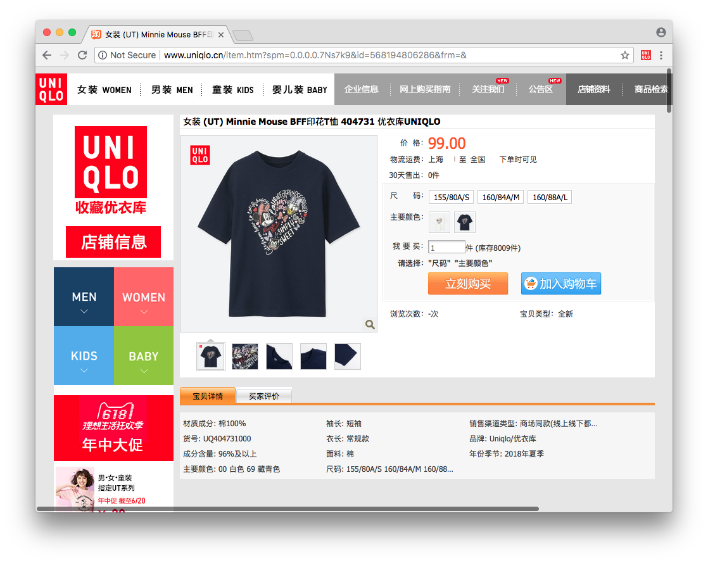
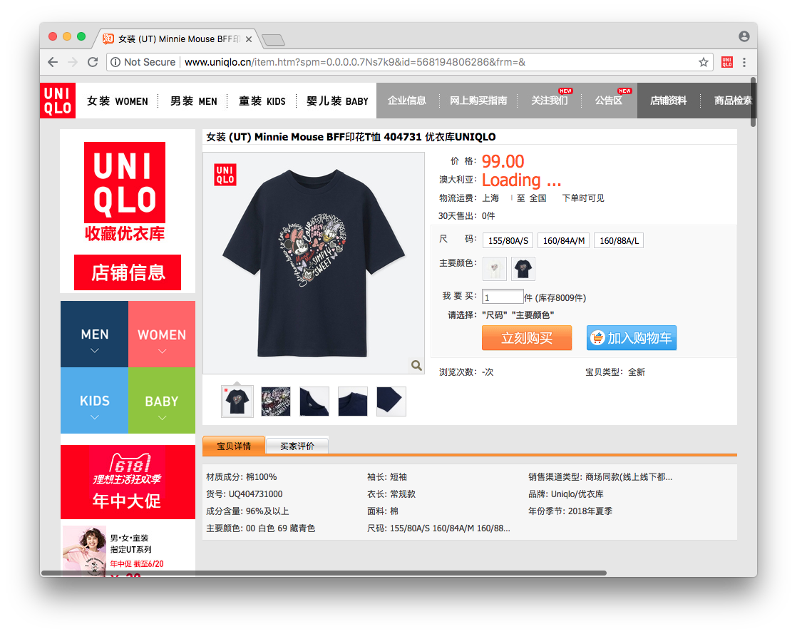

Uniqlo CN Chrome Extension in Kotlin JS
=========

This is an extension just for fun.

Build
---
run `./gradlew clean build`. A `dist` folder will be created after the build

Install
---
1. `Window` -> `Extensions` or type `chrome://extensions/` to open the `Extensions` window
2. turn on `Developer mode` of chrome
3. click `Load unpacked` button and select the `dist` folder of this project

What it does
---------
1. open any of the item of uniqlo cn site e.g. http://www.uniqlo.cn/item.htm?spm=0.0.0.0.7Ns7k9&id=568194806286&frm=&
    

2. click the extension button

    

3. it will add the converted price and the link of the same item of Australian site in the page

    

Reference
---------
* https://developer.chrome.com/extensions/getstarted
* https://robots.thoughtbot.com/how-to-make-a-chrome-extension
* https://github.com/Kotlin/kotlin-fullstack-sample
* https://kotlinlang.org/docs/tutorials/javascript/working-with-javascript.html
* https://github.com/DefinitelyTyped/DefinitelyTyped/blob/master/types/chrome/index.d.ts
* https://stackoverflow.com/questions/43871637/no-access-control-allow-origin-header-is-present-on-the-requested-resource-whe
* ~~http://fixer.io/~~ https://exchangeratesapi.io/api/latest